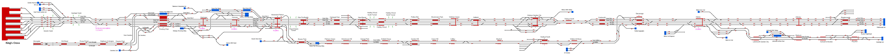

# UK-King's Cross

A contributor named SMG4 submitted this railway several years ago but publication awaited a timetable. Unfortunately no timetable was submitted so it was left for a long time gathering dust.  It was a detailed and impressive layout so on rediscovering it recently it seemed appropriate to resurrect and update it in line with the current track layout, and develop a timetable for it.

The railway includes the lines from King's Cross and Moorgate in the south to Biggleswade on the East Coast Main Line and Royston on the Cambridge line, a distance of over 40 miles south to north.

The timetable corresponds to the 2021 summer working timetable (courtesy [www.realtimetrains.co.uk](www.realtimetrains.co.uk)) and includes all King's Cross and Moorgate services from just before 6:00am to after 2:00pm. Excluded so far are freight and services that avoid King's Cross or Moorgate, notably those running via St Pancras and Thameslink. These may be added at a later date.

Operation is quite intense most of the time - it isn't a railway for the faint-hearted!  There are few opportunities for speeding up operation, and 1/2x speed and even 1/4x are required at especially busy times.  The 'Actions due' panel is essential for keeping on top of movements.  Operating a railway with such heavy traffic certainly makes you appreciate the intricate work of real-world timetable planners!

## Current Status

| Stage         | Status        |
| ------------- |:-------------:|
| Track Plan     |  |
| Signalling      |  |
| Naming |  |
| Speed Limits |  |
| Distances |  |
| Timetable |  |
| Documentation |  |
| Testing |  |

## Data Sources

- SMG4 original railway build
- [RealTimeTrains](www.realtimetrains.co.uk)
- London North Eastern Sectional Appendix June 2021
- Status icons by Freepik, pixelmeetup, Pixel Perfect on FlatIcon.com
